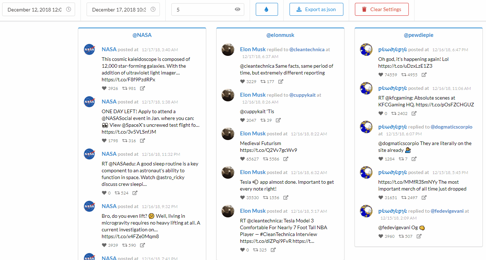
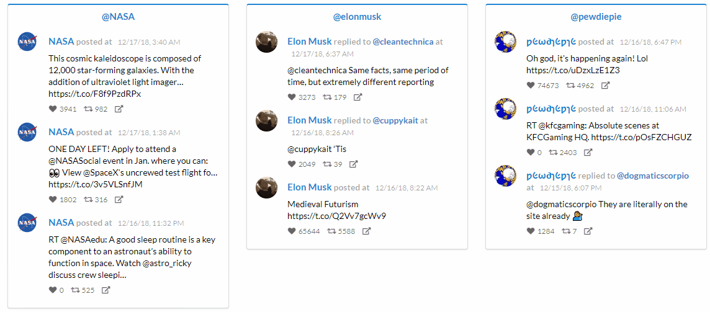
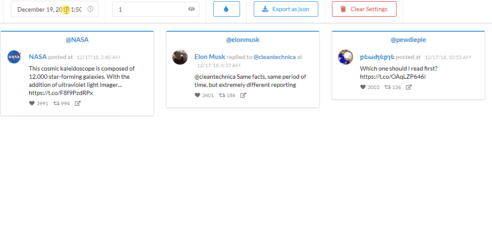
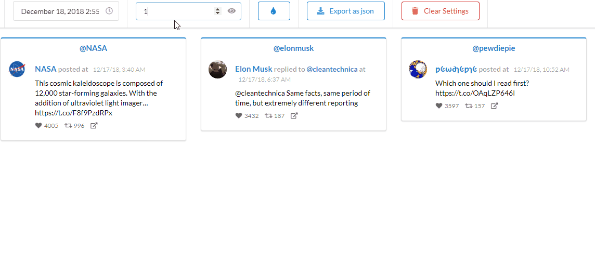
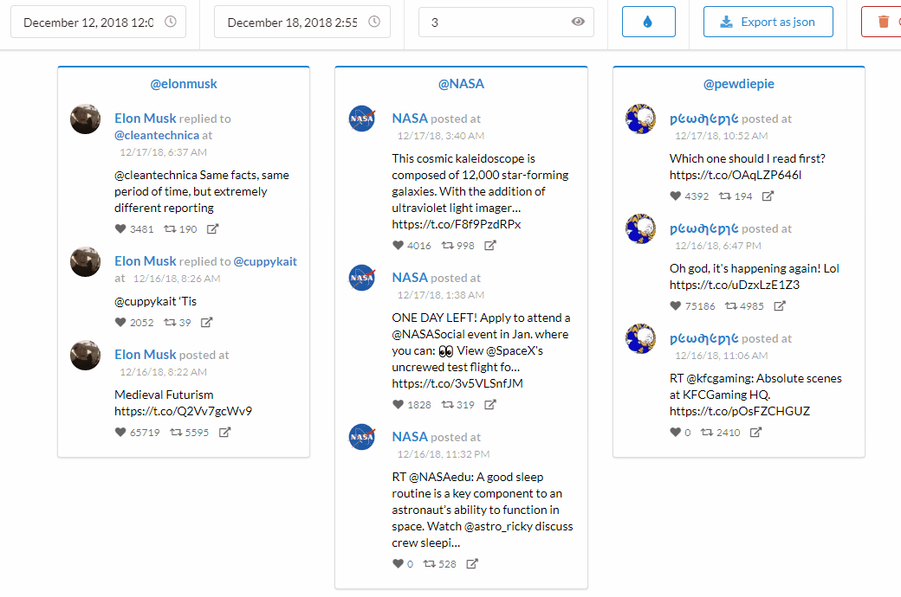

#  Twitter Feed Reader

This project was a front end challenge. For more infomation about requirements and rules check [Front-end challenge Oct 13 Document](https://docs.google.com/document/d/1KzhCDSa-mXtpuZfMtlbGoC6dFSGWixk-4ZQh0SCnGRY/edit)

## Setup

Install the server side dependencies:

`npm install`

This server will help you to get Twitter's API to send you tweets without you needing to do any authentication.  You don't need to modify server.js at all. 

Install the client dependencies:

`cd view-src`

`npm install`

## Running

Update config.json with your Twitter API credentials.
- Start the static and proxy servers:
`npm start`

- Run client in dev mode:

`cd view-src`

`ng serve`
## Build compiled client

`cd view-src`

`ng build`

## Features
### ✔️ Themable
User can also invert colors

### ✔️ Easing ordering with drag'n drop

### ✔️ Live reloading result

### ✔️ Responsive

### ✔️ Save settings
All settings will be saved when a change occurs 

### ✔️ Export tweets as json
User can export feed result as a .json file

## Credit
* [Semantic UI](https://github.com/Semantic-Org/Semantic-UI)
* [dragula](https://github.com/bevacqua/dragula)
* [Angular](https://github.com/angular/angular)

## App Info
[Note](https://github.com/SaadRegal/twitterFeedReader/blob/master/view-src/README.md#note-about-dynamic-style)

### Author
[Saad Regal](https://github.com/SaadRegal/)

### Version

1.0.0

### License

This project is licensed under the MIT License
